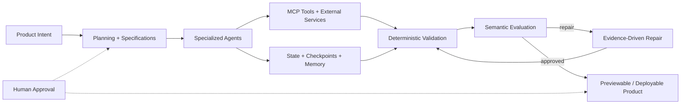

# Hi, I'm Pratik Kanjilal

### Agentic AI Engineer | Multi-Agent Systems | RAG | MLOps

I build AI systems that do more than generate text: they **plan, use tools, preserve state,
coordinate specialized agents, validate their work, repair failures, and deliver usable software**.

My current focus is production-oriented Agentic AI with LangGraph, LangChain, MCP, reliable
evaluation and repair loops, human-in-the-loop control, retrieval engineering, and cost-aware model
orchestration.

  
  
  
  
  
  
  
  
  

## Agentic AI Engineering

- **LangGraph orchestration:** durable parent workflows, repair subgraphs, conditional routing,
  checkpointing, long-term memory, resumable execution, and human approval gates.
- **Multi-agent architecture:** planner, design, database, backend, frontend, evaluator, artifact,
  and repair responsibilities with explicit contracts and file ownership.
- **MCP and tool use:** policy-controlled tools, browser automation, web search, provider actions,
  output redaction, auditability, and bounded execution.
- **Reliability engineering:** canonical file manifests, deterministic validation, failure
  fingerprinting, targeted repair, runnable fallbacks, security guardrails, and sandboxed previews.
- **Cost-aware AI:** role-based model routing, token accounting, per-run cost ledgers, hard budget
  ceilings, context optimization, and bounded retries.
- **RAG systems:** hybrid retrieval, embeddings, reranking, diversity filtering, context compression,
  source isolation, and grounded generation.

## How I Build Agentic Products

## Featured Projects

### [Agentic Forge](https://github.com/Pratik23-pk/agentic-forge)

A guarded, budget-aware multi-agent software development studio that converts natural-language
requirements into generated, validated, repairable, previewable, and downloadable applications.

`LangGraph` `MCP` `OpenAI` `FastAPI` `React` `TypeScript` `PostgreSQL` `Supabase` `Redis`
`Playwright` `Docker` `LangSmith`

- Durable LangGraph workflow with checkpointing, memory, conditional routing, and human approvals
- Specialized planner, design, database, backend, frontend, evaluator, and repair responsibilities
- Universal Repair Kernel with structured evidence, full-project context, and bounded escalation
- Deterministic capability adapters, dependency audits, browser tests, guardrails, and isolated previews
- Per-node model routing and a global cost ledger for controlled production economics

### [Mermaid Research Copilot](https://github.com/Pratik23-pk/mermaid_researchCopilot)

A user-isolated RAG system for PDFs and web content with Django authentication, FastAPI ingestion,
ChromaDB storage, hybrid lexical/vector retrieval, reranking, diversity filtering, and context
compression.

### [Workforce Intelligence MLOps](https://github.com/Pratik23-pk/workforce-mlops)

An end-to-end workforce forecasting platform with a PyTorch multi-head model, FastAPI inference,
DVC pipelines, MLflow tracking, Docker, GitHub Actions, Kubernetes, and GitOps-ready deployment.

### [Bowel Sound Detection AI](https://github.com/Pratik23-pk/bowel_sound_app_COMPLETE)

A biomedical audio-classification system using CRNN models, MFCC features, signal processing, and
deep-learning workflows for applied health AI research.

## Technical Toolkit

| Area | Technologies and Practices |
| --- | --- |
| Agentic AI | LangGraph, LangChain, MCP, multi-agent workflows, tool calling, memory, HITL, evaluation and repair |
| LLM and RAG | OpenAI APIs, embeddings, ChromaDB, hybrid search, reranking, prompt and context optimization |
| Backend and Data | Python, FastAPI, Django, Pydantic, PostgreSQL, Supabase, Redis, REST APIs |
| Frontend and Testing | React, TypeScript, Vite, Playwright, responsive product interfaces |
| ML and Audio AI | PyTorch, scikit-learn, CRNNs, MFCCs, recommendation and ranking systems |
| MLOps and Platform | Docker, GitHub Actions, DVC, MLflow, Kubernetes, Argo CD, AWS |
| Reliability and Security | Guardrails, DLP, secret detection, dependency auditing, sandboxing, observability |

## Engineering Principles

- Use deterministic checks before asking an LLM to judge correctness.
- Preserve complete state so retries repair software instead of recreating it blindly.
- Give agents narrow responsibilities, explicit contracts, and only the tools they require.
- Treat cost, security, observability, and human control as architecture—not afterthoughts.
- Optimize AI systems for working outputs, reproducibility, and evidence-backed decisions.

## GitHub Snapshot

## Current Direction

I am focused on building reliable Agentic AI products that combine orchestration, retrieval,
software engineering, secure tool use, and deployment-aware workflows. I am open to Agentic AI,
Applied AI, AI Platform, ML Engineering, and backend-for-AI opportunities and collaborations.
